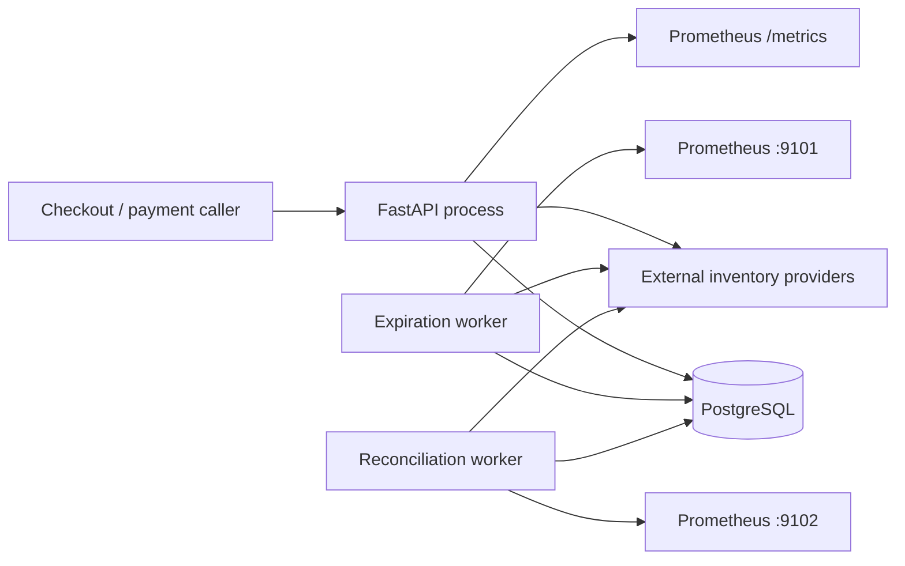

# Architecture

## Design Goals

This service protects inventory while a checkout is in progress. The design
therefore prioritizes correctness, explicit failure semantics, and recovery
over raw feature count. In particular, it must prevent overselling internal
stock, avoid duplicating orders, and never interpret an external-provider
timeout as proof that an operation failed.

The implementation is intentionally sized as one bounded context and one
deployable codebase. PostgreSQL is the source of truth for reservations,
internal inventory, orders, allocations, and durable provider-operation state.
External providers remain authoritative for inventory they own.

The main design goals, in priority order, are:

1. preserve inventory invariants under concurrent requests;
2. make client and provider operations idempotent;
3. distinguish definite failure from an unknown remote outcome;
4. make expiration and recovery restart-safe and horizontally executable;
5. keep business behavior testable without FastAPI, SQLAlchemy, or real
   provider APIs;
6. expose enough operational evidence to diagnose background processing.

## Architectural Shape

The project uses a pragmatic three-layer structure:

```text
inventory_reservation/
├── controller/  # HTTP contracts and executable composition roots
├── service/     # domain language, policies, and use-case orchestration
└── repository/  # PostgreSQL and external-provider adapters
```

The runtime request flow is `Controller -> Service -> Repository`. The source
dependency for infrastructure is inverted where it matters: the service layer
defines repository and provider ports, and repository adapters implement those
ports. Composition roots are the only code that knows concrete implementations
and wires them together.

This is Clean Architecture without adding a directory for every pattern. The
service layer has no FastAPI, SQLAlchemy, or HTTPX dependency. Controllers map
transport data and errors; repositories own I/O. There are no pass-through
`Controller`, `Service`, or `Repository` classes created merely to satisfy a
template.

The Domain-Driven Design boundary is the **Inventory Reservation** bounded
context. Its ubiquitous language—Reservation, Allocation, Hold,
Confirmation, Release, Provider Operation, and Unknown Outcome—is defined in
`CONTEXT.md` and used in code and tests. Product catalog, user authentication,
cart management, and payment processing belong to other contexts.

## Runtime Topology

There are three independently executable processes sharing PostgreSQL:



- The API exposes create, retrieve, confirm, and cancel operations.
- The expiration worker finds overdue pending reservations and releases their
  allocations.
- The reconciliation worker resolves unknown confirmation and release
  outcomes using bounded retries.

The workers are separate processes so they can be deployed, restarted, and
scaled independently. Both use bounded batches and `FOR UPDATE SKIP LOCKED`;
multiple instances can share the work without a central scheduler. `SIGINT`
and `SIGTERM` stop each polling loop gracefully.

## Domain Model and Reservation Lifecycle

The Reservation is the consistency focus. It contains one or more requested
items, an owner, an idempotency identity, a creation time, and an expiry time.
Each item receives an Allocation recording the provider, quantity, hold
reference, and current allocation status.

The externally visible reservation states are:

```text
pending ──confirm──> confirming ──reconciled──> confirmed ──> order
   │                      └──definite rejection──> failed
   │
   ├──cancel──> releasing ──reconciled──> cancelled
   │
   └──TTL─────> releasing ──reconciled──> expired
```

Transitions may skip the intermediate state when every provider responds
conclusively in the initiating request. `confirming` and `releasing` are
durable states, not transient in-memory flags. A releasing reservation stores
its intended terminal state (`cancelled` or `expired`) so a restarted worker
can complete the original transition.

Important invariants are enforced at more than one level:

- Domain values reject empty reservations, non-positive quantities, and
  non-positive TTLs.
- PostgreSQL prevents negative or over-reserved internal inventory.
- A reservation cannot contain the same product twice.
- `(user_id, idempotency_key)` uniquely identifies a create request.
- Provider-operation idempotency keys are unique.
- `orders.reservation_id` is unique, so one reservation creates at most one
  order.

## Core Flows

### Create reservation

The caller supplies a verified `X-User-ID`, an `Idempotency-Key`, and the
requested items. The service hashes a canonical representation of the items.
Reusing the key with the same fingerprint returns the existing reservation;
reusing it for a different request returns a conflict. The database uniqueness
constraint resolves the race where two identical create requests pass the
initial read concurrently.

For every item, eligible hold-capable providers are loaded in deterministic
allocation-priority order. The router tries candidates until one conclusively
holds stock. Internal inventory uses a single conditional SQL `UPDATE`, so the
availability check and reservation increment are atomic. External inventory
uses the provider hold contract and stores its hold reference in the
allocation. The current model assigns the entire quantity of one item to one
provider; it does not split a line across sources.

If a later item cannot be allocated, every earlier allocation is compensated.
Internal holds are returned and external holds are released with deterministic
keys. The failed reservation is committed so a repeated create request returns
the same insufficient-inventory result without holding stock again. If an
external compensating release times out, the reservation remains durably
`releasing` with `failed` as its target and the reconciliation worker completes
it after backoff.

### Confirm reservation

The repository locks the reservation and its allocations. Internal
confirmation atomically decreases both `on_hand` and `reserved`. External
confirmation uses a deterministic key derived from reservation and allocation
IDs. Once every allocation is confirmed, the reservation becomes confirmed
and an order is created in the same PostgreSQL transaction. Repeating confirm
is safe, and the unique reservation-to-order constraint is a final duplicate
guard.

### Cancel or expire reservation

Cancellation is explicit; expiration is selected by the TTL worker. Both use
the same release behavior. Internal stock decrements `reserved`; external
stock calls the provider with the saved hold reference and a deterministic
release key. A conclusive release reaches `cancelled` or `expired`. An unknown
outcome leaves the reservation in `releasing` with its target status intact.

### Reconcile an unknown outcome

Unknown confirm and release operations are stored in
`provider_operations`. The reconciliation worker selects only due operations
below the configured attempt limit. Retries reuse the original idempotency key
and schedule the next attempt with persisted exponential backoff. Successful
confirmation can safely create the order; successful release completes the
saved terminal transition.

## Consistency and Failure Handling

PostgreSQL transactions protect all local changes for one use case. Row locks
serialize competing confirm/cancel operations on a reservation. Conditional
inventory updates avoid a read-then-write race. Expiration and reconciliation
batches use `SKIP LOCKED` to avoid duplicate work and head-of-line blocking
between worker instances.

Provider outcomes are classified deliberately:

- **Held / confirmed / released:** apply the corresponding local transition.
- **Out of stock or definite rejection:** treat as a conclusive business
  result.
- **Temporary unavailability:** allow another eligible hold provider to be
  considered.
- **Unknown outcome, usually a timeout:** do not fail over blindly. The first
  provider may already have accepted the operation, so trying another could
  double-reserve or double-consume inventory.

The in-process circuit breaker counts transport/server failures and unknown
outcomes, opens after a configurable threshold, rejects calls during its
recovery window, and permits only one half-open probe. Its state is
intentionally per process; correctness does not depend on sharing it.

There is no distributed transaction between PostgreSQL and an external
provider. External calls currently execute while a database transaction is
open. This keeps the code and local transition easy to reason about for the
take-home scope, but increases lock duration and cannot make remote and local
commit atomic. Idempotency and reconciliation reduce that risk; they do not
remove it.

## Provider Scenarios

The implementation and tests cover more than the two scenarios requested:

1. **External hold succeeds.** The provider is called before internal fallback,
   its hold reference is stored, confirmation is sent once, and exactly one
   order is created. This proves the primary marketplace checkout path.
2. **A hold times out.** The result is classified as unknown and routing stops
   instead of falling back. This is important because a timeout can happen
   after the provider committed the hold.
3. **Confirmation or release times out.** The reservation enters
   `confirming` or `releasing`; the durable operation is retried with the same
   key only after its persisted backoff expires. This demonstrates recovery
   from the most dangerous mid-lifecycle failure.
4. **A provider is unavailable.** Failures contribute to circuit state, and a
   conclusive unavailable result allows another capable provider to serve the
   hold. Half-open probing prevents a recovering provider from receiving a
   burst of probes.

These scenarios were chosen because they exercise different correctness
decisions. A successful call proves integration, while timeout handling proves
that failure semantics—not just HTTP wiring—were designed.

## Deliberate Scope Decisions

- **One bounded context, not microservices.** Splitting reservation, order, and
  internal inventory would introduce distributed consistency without a
  demonstrated scaling need.
- **PostgreSQL polling, not a message queue.** Expiration and reconciliation
  already require durable database state. Indexed `SKIP LOCKED` queries give
  restart safety and parallelism with fewer moving parts at this scale.
- **Synchronous provider calls.** The create response reports whether stock was
  actually held. An asynchronous saga would improve latency isolation but
  would require a pending workflow and a client notification contract absent
  from the task.
- **No cache for inventory correctness.** Internal availability is decided by
  a guarded database update. A cache could serve informational reads later but
  must not authorize a hold.
- **UUIDv7 identifiers.** They remain globally unique and non-enumerable while
  providing better B-tree locality than UUIDv4. A high-volume append-only table
  could later use `BIGINT` internally if measurements justify it.
- **Secret references, not provider secrets.** The schema stores provider
  authentication type and a `secret_ref`. A service-layer `SecretResolver`
  port isolates credential lookup, while the default infrastructure adapter
  resolves `env://VARIABLE_NAME` references at call time. This keeps rotation
  independent of database writes and prevents raw secrets from entering
  PostgreSQL. Production deployments can replace the adapter with Vault or a
  cloud secret manager without changing checkout behavior.
- **No generic provider framework.** A typed HTTP adapter covers the working
  contract. New protocols should be added when a real second contract exists,
  not pre-designed speculatively.

## Assumptions

- Authentication is upstream. `X-User-ID` is trusted only because the task
  states it is already verified.
- Confirm and cancel endpoints represent trusted payment-success and
  payment-failure/abandonment inputs. Payment execution is outside this
  bounded context.
- External providers honor idempotency keys for hold, confirm, and release.
  Retrying an unknown operation would otherwise be unsafe.
- Provider priority is configured per inventory level and is deterministic.
- A single provider must satisfy the full quantity for one reservation item.
- External availability rows establish product/provider eligibility; the
  provider remains authoritative when its hold endpoint is called.
- A release returning `404` means the hold no longer exists and is therefore
  idempotently released.
- Reservation TTL defaults to 15 minutes and is configurable at deployment.
- Background processing is at-least-once. Database locks, idempotency, and
  uniqueness constraints make repeated work safe.
- A provider operation that exhausts its retry limit remains visible as
  unknown and requires operational investigation; it is not guessed into a
  terminal business state.

## What I Would Change With More Time

The first change would be to move external calls out of long-held PostgreSQL
transactions. I would persist an operation intent first, commit it, execute the
remote call, and then apply the result in a second short transaction. A
transactional outbox or durable workflow engine could dispatch the intent.
That design needs explicit `reserving` and client-observation semantics rather
than being added as an invisible optimization.

Multi-item checkout now compensates every conclusive earlier hold when a later
item fails, and an unknown compensating release is durable and reconcilable.
The remaining correctness gap is before that point: the initial external hold
intent is not committed before the provider call. A timeout—or a process crash
after the provider accepts the hold but before its allocation is saved—needs a
durable hold operation plus a provider status query or an unknown-hold
reconciliation path.

Other follow-up work, in order, would be:

1. add an operator interface and alerts for exhausted unknown operations,
   including manual retry or resolution with a complete audit trail;
2. accept payment outcomes through an idempotent event consumer and publish
   `OrderCreated` through an outbox when event-driven integration is required;
3. add OpenTelemetry traces across SQL and provider calls, provider-level
   metrics, backlog-age gauges, and Sentry-style exception capture;
4. implement Vault or cloud-secret-manager resolver adapters with caching,
   rotation notifications, and resolver health metrics;
5. run contract, load, and fault-injection tests to tune batch sizes,
   connection pools, circuit thresholds, timeouts, and retry budgets from
   evidence;
6. split hot operational tables by time or provider only after query and index
   measurements show PostgreSQL is the bottleneck.

These are not hidden claims about the current implementation. They are the
points where its explicit simplicity would stop being the right trade-off.
